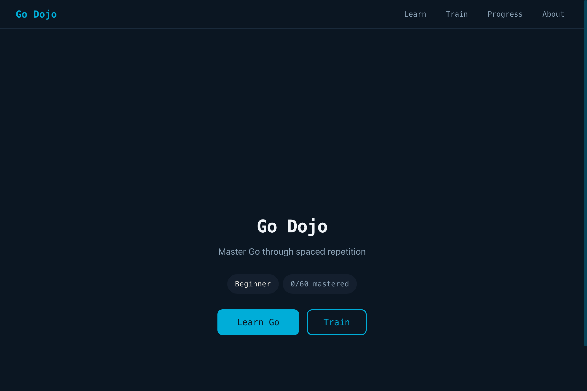

# Go Dojo

Learn Go through spaced repetition and visual metaphors.

**[olgasafonova.github.io/godojo](https://olgasafonova.github.io/godojo/)**



## How it works

60 quiz cards organized into six belts, from variables and loops (white) to reflection and unsafe pointers (black). The SM-2 algorithm schedules each card at the right interval. Get it right and it fades into the background. Get it wrong and it shows up again tomorrow morning.

Sessions are 10 cards. Due reviews first, then new material. Progress lives in localStorage; nothing leaves your browser.

## Visual metaphors

Every concept has a gopher illustration. Slices become sushi rolls. Channels become copper pipes. A goroutine queue becomes a row of gophers waiting for an alarm clock. The images give the spaced repetition algorithm something to anchor to beyond dry definitions.

## Why "Dojo"

A dojo is a place for practicing a discipline through repetition. The Japanese word means "place of the way." You drill until muscle memory takes over. That is the idea here.

Go Dojo has a sibling: **[KanaDojo](https://olgasafonova.github.io/kanadojo/)**, the same engine applied to Japanese hiragana and katakana.

## Stack

React 19 / TypeScript / Vite / Shiki / SM-2 / Web Audio API / Claude Code / GitHub Pages

Yes, this is a Go learning app written in TypeScript. The irony is noted.

## Run locally

```bash
npm install
npm run dev
```

## Credits

Built by [Olga Safonova](https://github.com/olgasafonova). Concept illustrations generated with AI. Gopher mascot tradition by Renee French.
