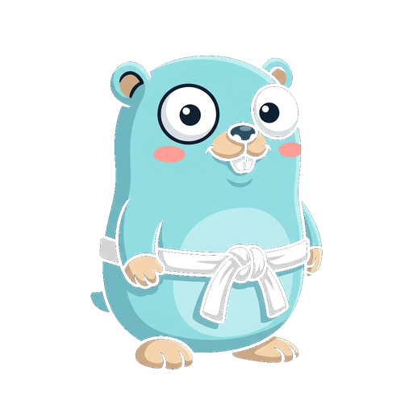
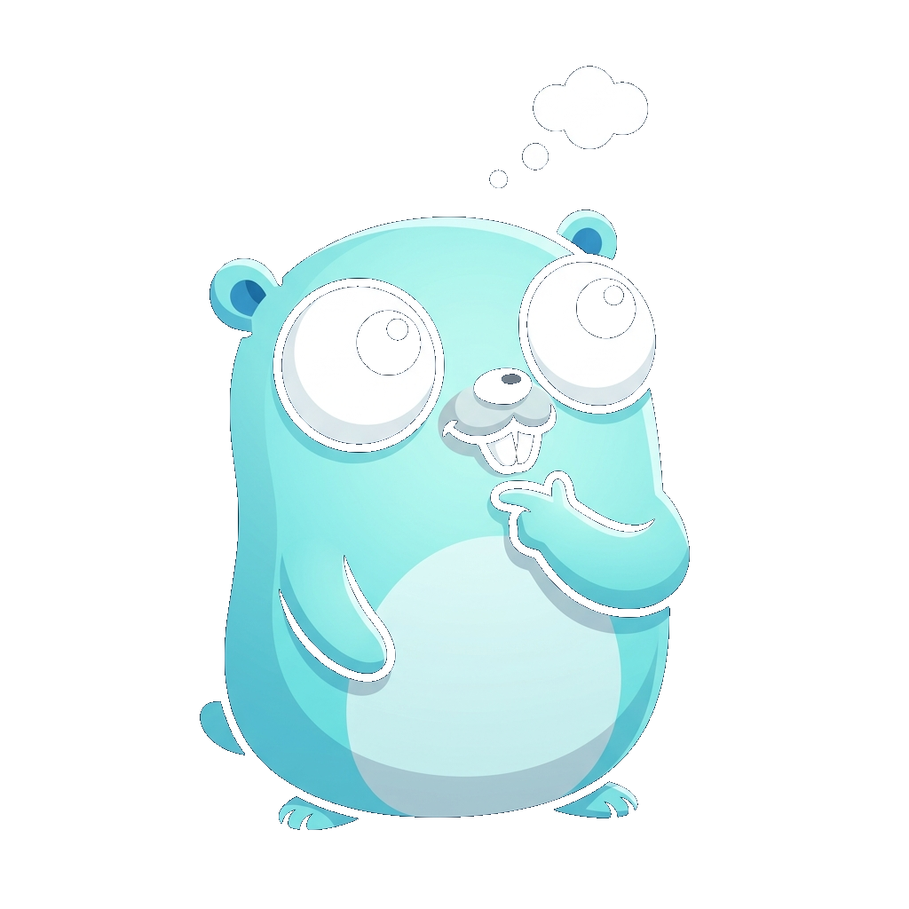
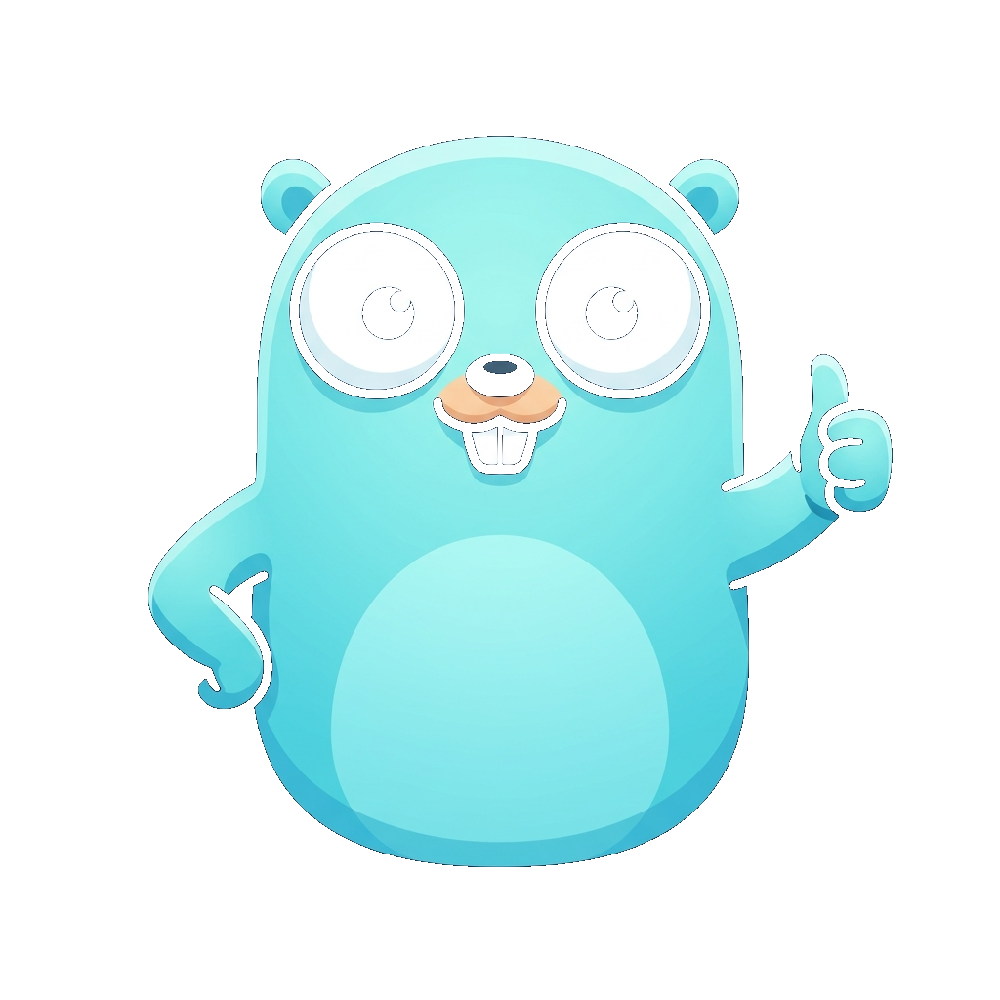
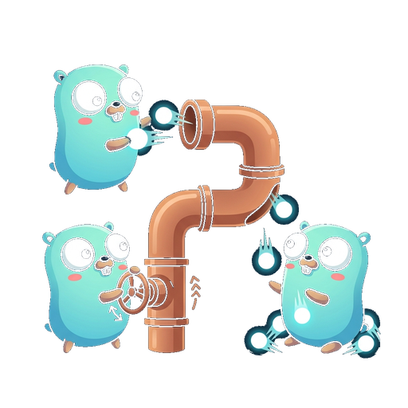
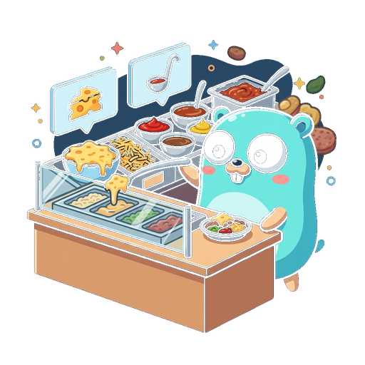

# Go Dojo

A flashcard app for learning Go through spaced repetition and small determined gophers.

**[Try it live](https://olgasafonova.github.io/godojo/)**

<p>
  
  
  
  
</p>

## What it does

60 quiz cards covering Go from variables to reflection. The SM-2 spaced repetition algorithm schedules reviews so you spend time on what you don't know yet. Get a card right and it recedes into the distance. Get it wrong and it comes back tomorrow.

Cards are organized into six belts (white through black), each mapped to a topic area. Progress is stored in localStorage; nothing leaves your browser.

## Why the illustrations

Every concept has a gopher illustration acting as a visual metaphor. Slices become sushi rolls. Channels become copper pipes. Goroutines become a queue of gophers waiting for an alarm clock. The brain holds images better than definitions, and the spaced repetition algorithm has something richer to reinforce than dry quiz text.

<p>
  
  
  
  
</p>

## Why "Dojo"

A dojo is a place for practicing a discipline through repetition. You don't read about a technique once and move on. You drill it until muscle memory takes over.

Go Dojo has a sibling: [KanaDojo](https://olgasafonova.github.io/kanadojo/), the same engine applied to Japanese hiragana and katakana.

## Stack

React 19, TypeScript, Vite, Shiki (syntax highlighting), Web Audio API (sound effects), SM-2 (spaced repetition), Claude Code, GitHub Pages.

Yes, this is a Go learning app built in TypeScript. The irony is noted.

## Run locally

```bash
npm install
npm run dev
```

Opens at `http://localhost:5173/godojo/`.

## Deploy

Pushes to `main` trigger a GitHub Actions workflow that builds and deploys to GitHub Pages.

## Credits

Built by [Olga Safonova](https://github.com/olgasafonova). Concept illustrations generated with AI. The gopher mascot follows the tradition of the Go gopher by Renee French.
